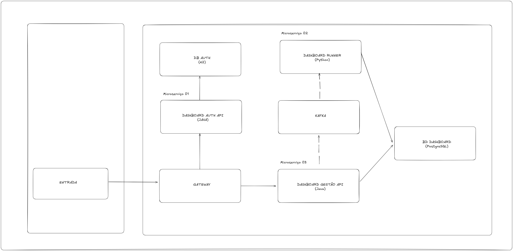

## Arquitetura



## Projetos

- [Dashboard code in Java](https://github.com/kielsonzinn/Dashboard-gestao-API)
- [Runner code in Python](https://github.com/andreruizrt/automatic-code-review-dashboard-runner/tree/kafka_consumer)

## O que foi feito

- Dashboard gestao em java
- Dashboard runner em python
- Dashboard auth em java
- Mensageria com Kafka
- Ambiente em docker + docker-compose
- Gateway em nginx
- Spring, spring authentication, feign e validator
- PostgreSQL e H2
- Postman e swagger

## Preparando ambiente

- Rodar docker-compose
```sh
docker-compose up --build
```

- Troubleshooting
    - Pode ser necessario executar os comandos com permissao `sudo`
    - Pode ser necessario usar o `docker compose` no lugar de `docker-compose`

## Usando o ambiente

- Usar o [postman-collection](https://github.com/andreruizrt/acr-gateway/blob/main/DashboardRequest.postman_collection.json)
- Ao chamar o endpoint de Login, já ira setar automaticamente o token para as proximas requests
